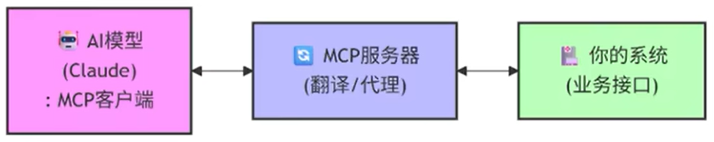

## 1.MCP是什么
MCP（Model Context Protocol，**模型上下文协议**）是由Anthropic于2024年底推出的一项开放标准协议。**MCP是定义在\[AI应用（MCP客户端宿主）]和\[外部数据源/工具（MCP服务器）]之间的标准化通信协议**。让AI模型能统一调用外部世界的接口和数据

我们可以让SpringBoot项目实现MCP协议（项目变成一个实现MCP协议的MCP服务器），这样AI应用就可以直接调用SpringBoot项目中的业务接口，实现**自然语言驱动**的系统操作
#### 1.1MCP客户端
MCP客户端，**简单说就是连接并使用MCP服务器能力的AI应用程序**，它是你和AI交互的入口，负责把你的指令转成MCP服务器能读懂的操作，常见的MCP客户端可以分为以下几类

| 类别        | 常见客户端                  | 特点于适用场景                        |
| --------- | ---------------------- | ------------------------------ |
| 桌面AI应用    | Claude Desktop（桌面助手）   | Anthropic出品，配置简单，是最直接的入门选择     |
| IDE与代码编辑器 | VS Code Copilot、Cursor | 将AI能力深度集成到开发环境，是开发者使用MCP最自然的场景 |
这些客户端存在的意义，是让你可以通过自然语言对话，让AI直接操作各种工具和数据
#### 1.2MCP服务器
MCP服务器，简单说就是一个“翻译官”/“中间人”或“适配器”，职责如下：
- 暴露能力：把自己能做的事（业务功能）用MCP标准格式“告诉”AI
- 接受指令：接收AI发来的请求
- 执行业务：真正去干活（调用SpringBoot接口）
- 返回结果：把执行结果翻译成AI能懂的格式返回给AI

AI说人话 → MCP服务器翻译成API调用 → 系统执行并返回数据 → MCP服务器翻译成自然语言 → AI回答用户
## 2.MCP协议
#### 2.1为什么需要MCP
在MCP出现之前，每当你想让一个AI（如Claude）去调用一个新工具（比如Gitee或日历），都需要为这个组合单独写一套适配代码。这种方式的弊端非常明显
- **切换模型麻烦**：为ChatGPT写的工具Claude用不了，反之亦然，造成大量重复劳动
MCP皆在为 AI应用+大语言模型+外部数据源、工具和服务之间，建立统一、安全、高效的双向通信通道
#### 2.2核心理念
在没有统一协议前，每让AI应用接入一个新工具，都需要编写特定的“适配代码”，形成了极高的“**N\*M**”集成复杂度。MCP的核心思想是通过定义一套标准，**将集成复杂度从“乘数关系（N\*M）”简化为“加数关系（N+M）”**。这意味着，开发者只需要为工具开发一次MCP服务器，任何支持MCP的AI客户端都可以直接调用它，实现“即插即用”
#### 2.3核心架构：三层模型
MCP采用经典的“客户端-服务器”架构，并创新的引入了“宿主”层，形成三层结构：
1. **MCP宿主（Host）**：AI应用本身，如你正在使用的AI IDE、聊天应用等。他是用户交互的入口，负责管理多个MCP客户端
2. **MCP客户端（Client）**：嵌入在宿主应用内部，与特定的MCP服务器保持一对一连接，它的核心工作是与服务器通信，并将服务器的能力“翻译”给AI模型，同时把AI的请求发送给服务器执行
3. **MCP服务器（Server）**：能力的最终提供者。他是一个独立的轻量级程序，通过MCP协议向外暴露其功能。服务器可以运行在本地，也可以部署在云端
#### 2.4三大核心功能
- **工具（Tools）**：**可执行函数**，供AI模型调用以执行操作，AI模型可以理解工具的描述和所需的参数，并自主决定何时调用他们。
- 资源（Resources）：只读的上下文数据，供AI模型理解