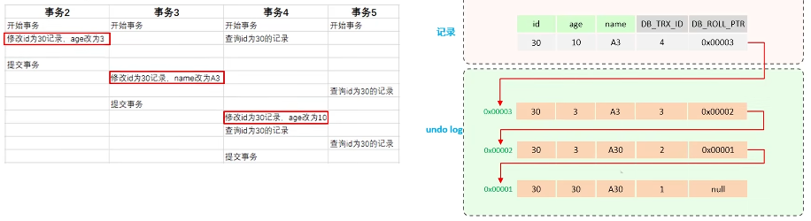

## 1.如何定位慢查询
- 使用运维工具-ShyWallking：可以监控出哪个接口是因为SQL的问题，导致响应慢
- 在MySQL中配置慢查询阈值，并开启慢日志查询，一旦SQL执行时间超过阈值就会将SQL记录到日志中（调试阶段使用）
## 2.SQL分析
使用MySQL自带的分析关键字 EXPLAIN
- 通过key和key_len检查是否命中了索引（检查是否存在索引失效的情况）
- 通过type字段查看SQL是否有进一步的优化空间（是否存在全索引扫描或全盘扫描）
- 通过extra建议，判断是否出现了回表查询
## 3.索引
##### 3.1什么是索引？
- 索引是帮助MySQL高效获取数据的数据结构（有序）
- 索引可以提高数据的检索效率，降低数据库IO成本（不需要全表扫描）
##### 3.2索引的底层结构？
MySQL的默认的InnoDB引擎采用B+树，来存储索引
- 阶数更少，路径更短
- 磁盘读写代价更低（非叶子节点只存储key，叶子节点存储数据）
- B+树便于扫库和区间查询（叶子节点是一个双向链表）
	
##### 3.3一级索引和二级索引
- 一级索引：有且只有一个，数据和索引放到一块，B+树的叶子节点保存了整行数据
- 二级索引：可以有多个，数据和索引分开存储，B+树的叶子节点保存 索引字段+对应的主键
##### 3.4回表查询和覆盖索引
回表查询：
	通过二级索引找到对应主键，到一级索引中查找整行数据，这个过程就是回表
覆盖索引：
	查询使用了索引，返回的列必须在索引中全部能够找到
##### 3.5深分页/超大分页
解决方案：覆盖查询+子查询（通过减少回表次数来降低大量的磁盘 I/O 消耗）
```
select *
	from table_a a
		(select id from table_b order by id limit 9000000,10) b
where a.id = b.id;
```
##### 3.6索引的创建原则（主要）
1. 数据量较大，切查询频繁的表
2. 常作为查询条件、排序、分组的字段
3. 尽量使用联合索引
4. 控制索引数量
##### 3.7索引失效
- 违反最左前缀法则
- 范围查询右边的列，不能使用索引
```
select * from table where name='小米科技' and status>'1' and address='北京'
```
- 字符串不加引号，造成索引失效（类型转换）
```
select * from table where name='小米科技' and status=0
```
- 以%开头的Like模糊查询，索引失效
```
select * from table where name='%科技'
```
- 不要在索引列上进行运算操作，索引将失效
```
select * from table where substring(name,3,2) = '科技'
```
##### 3.8SQL优化
1. 建表时规范选择数据类型
2. 创建索引
3. 查询时避免索引失效、避免使用`select * ...`
4. 架构上采用分库分表、主从复制、读写分离（避免数据写入，影响读操作）
## 4.事务
##### 4.1事务的特性
- A：原子性
- C：一致性
- I：隔离性
- D：持久性
##### 4.2并发事务存在的问题，以及解决措施
- 并发事务存在的问题：
	1. 脏读：一个事务读到另一个事务还没有提交的数据
	2. 不可重复读：在一个事务内，先后读取同一条数据，但两次读取到的数据不同
	3. 幻读：一个事务先后读取同一张表的数据，但两次读取到的数据不同
- 解决措施（事务隔离级别）
	
##### 4.3.Redo Log和Undo Log的区别
**Redo Log** - 保证事务持久性
定义：记录数据页的物理变化，在服务宕机时用来同步数据
组成：
- **重做日志缓冲**（redo log buffer）：内存中
- **重做日志文件**（redo log file）：磁盘上
相关概念：
- 缓冲池（buffer pool）：内存中的一个区域，里面缓存磁盘上经常操作的真实数据，在执行增删改查操作时，先操作缓冲池中的数据（若缓冲池没有数据，则从磁盘中加载并缓存），以一定频率刷新到磁盘，从而减少磁盘IO，加快处理速度
- 数据页（page）：是InnoDB存储引擎磁盘管理的最小单元，每个页的大小默认16KB，用来存储行数据
发生数据修改时，数据库底层的执行流程
1. **接收请求**：客户端发起操作请求
2. **写入缓冲池**：数据库先将数据页读入内存，修改操作首先操作缓冲池中的数据（此时内存中数据是最新的，磁盘上的数据还未修改）
3. **写入redo log buffer**：将本次修改以日志的形式记录到redo log buffer中
4. **redo log持久化**：将Redo log buffer中的数据刷入redo log file文件中
5. **数据页持久化**：后台线程在合适的时机异步将缓冲池中的数据页刷入磁盘对应的数据页中
为什么需要Redo Log Buffer？
- 合并写入，减少磁盘IO：如果每次修改都直接写磁盘，那磁盘的随机I/O次数会非常多。Buffer的存在可以将多次小规模修改合并为一次较大规模的顺序写入。
为什么必须先写入Redo Log File到磁盘，而不是直接把Buffer Pool中的数据页写回磁盘
- 性能：顺序写 远快于 随机写
	Redo Log是“顺序写”：日志文件是追加写入
	数据页是“随机写”：频繁修改散落在不同位置上的数据页，会涉及大量寻道时间，性能极差
- 数据安全与崩溃恢复
	如果直接写入磁盘数据页，若写入过程中数据库宕机，就会导致数据页中的数据既不是完整的新数据，也不是旧数据。而先写入到Redo Log File，保证了数据写入数据页的前提是磁盘中存在新数据备份，即使中途宕机，也可以根据Redo Log File保证数据的持久性

**undo log** - 保证事务的原子性和一致性
定义：记录的是逻辑日志，当事务回滚时，通过逆操作恢复原来数据
##### 4.4 解释一下MVCC（多事务版本控制）
- 隐藏字段
	1. 事务id：记录本行数据最后一次操作的事务id（事务id是自增的）
	2. 回滚指针：指向这条记录的上一个版本，用于配合Undo Log
- Undo Log
	1. 回滚日志，存储老版本数据
	2. 版本链：不同事务或相同事务对同一条记录进行修改，会导致该记录的Undo Log生成一条版该记录的版本链表，链表头部是最新的旧记录，链表尾部是最早的旧记录
	
- ReadView（解决事务查询选择版本的问题）
	- 根据ReadView的匹配规则和当前的事务id判断该访问哪个版本的数据
	- 不同隔离级别下，ReadView的生成规则是不一样，最终的访问结果也不一样
		- 读已提交：每一次执行快照读（事务中的select语句）时生成ReadView
		- 可重复读：仅在事务中第一次执行快照读时生成ReadView，后续复用