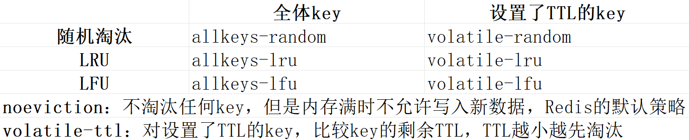

## AOF重写
AOF因为是记录命令，所以AOF文件会比RDB文件大的多。而且AOF会记录对同一个key的多次写操作，但只有最后一次写操作才是有意义的。通过执行 `bgrewriteaof` 命令，可以让AOF文件执行重写功能，用最少的命令达到相同的效果

同时Redis也会在触发阈值时自动重写AOF文件。阈值可以在redis.conf中配置
- AOF文件比上次文件增长超过多少百分比就触发重写
- AOF文件体积最小达到多大以上才触发重写
## 定期清理的两种模式
- SLOW模式：定时任务，默认频率10hz，每次不超过25ms，可以通过修改配置文件redis.conf的 `hz` 选项来调整
- FAST模式：执行频率不固定，但两次间隔不低于2ms，每次耗时不超过1ms
## 数据淘汰策略

## RedLock（红锁）
定义：不能只在一个Redis示例上创建锁，应该在多个Redis示例上创建锁（n/2 +1），避免在一个Redis示例上加锁