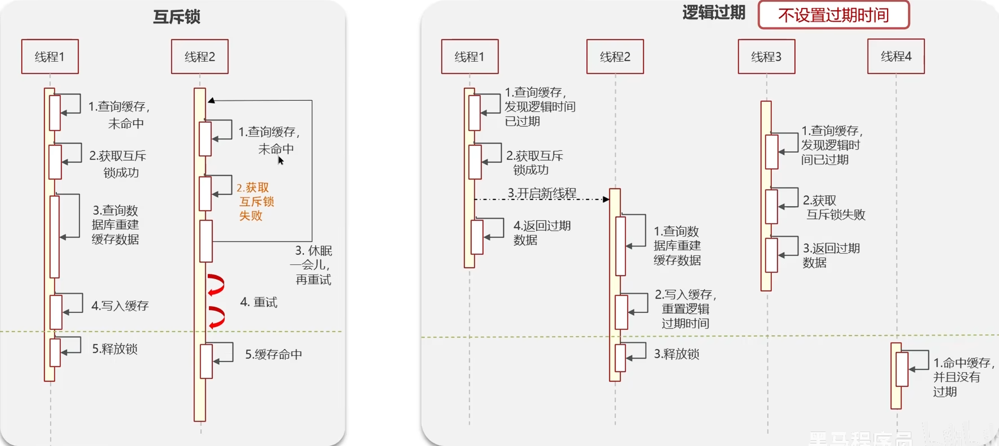
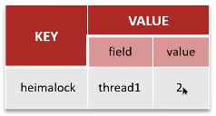
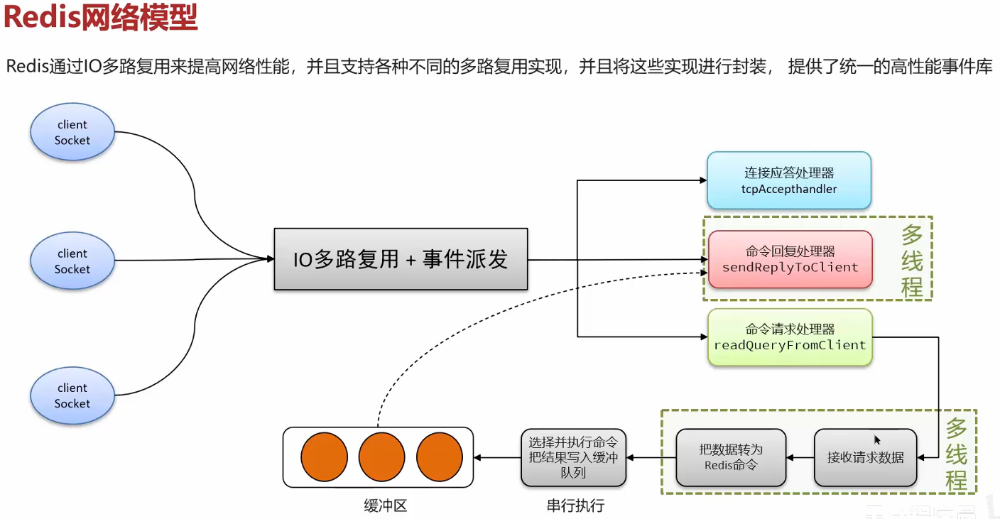

## 1.缓存穿透
定义：查询一个不存在的数据时，由于MySQL中查询不到数据也不会直接写入缓存，就导致每次请求都查数据库

解决方案
1. 缓存空数据
2. [布隆过滤器](布隆过滤器.md)
## 2.缓存击穿
定义：给某一个key设置了过期时间，当key过期的时候，恰好这时间点对这个key有大量的并发请求过来，这些并发的请求可能瞬间把DB压垮

解决方案
1. 互斥锁 - 强一致，性能差
2. 逻辑过期 - 高可用，性能好：在向Redis中添加数据时，不再给数据设置过期时间，而是额外给每个数据添加一个逻辑过期时间字段（见图右）

## 3.缓存雪崩
定义：在同一时段大量的缓存key同时失效或者Redis服务宕机，导致大量请求到达数据库，带来巨大压力
解决方案
1. 给不同Key的TTL添加随机值
2. 利用Redis集群提高服务可用性
3. 给缓存业务添加降级[限流](分布式限流.md)策略
4. 给业务添加多级缓存
## 4.Redis与MySQL的双写一致问题
- 高可用方案 - 异步通知
	1. 使用MQ中间件，数据库中数据更新完成后，通知缓存删除
- 强一致方案 - 采用Redisson提供的读写锁
	1. 读锁（共享锁）：加锁后，其他线程可以共享读操作
	2. 写锁（排他锁）：加锁后，阻塞其他线程读写操作，数据库中数据更新完成后，删除缓存中的旧数据
## 5.Redis数据如何持久化

|         | RDB(由bgsave命令主动触发)     | AOF(配置开启后在后台被动触发)                               |
| ------- | ---------------------- | ----------------------------------------------- |
| 持久化方式   | 内存快照                   | 记录每一次的执行命令（不包括查询）                               |
| 数据完整性   | 不完整，丢失RDB备份文件生成期间的数据变化 | 相对完整，取决于刷盘策略（同步刷盘、每秒刷盘、系统刷盘）                    |
| 文件大小    | 会有压缩，体积小               | 记录命令，文件很大                                       |
| 宕机恢复速度  | 快（文件小）                 | 慢（文件大）                                          |
| 数据恢复优先级 | 低（数据不完整）               | 高（数据完整性更高）                                      |
| 系统资源占用  | 高，大量CPU和内存消耗           | 低，主要是磁盘IO资源，但[AOF重写](注释.md#AOF重写)时会占用大量CPU和内存资源 |
| 适用场景    | 可以容忍数分钟的数据丢失，追求更快的启动速度 | 对数据安全性要求较高                                      |
## 6.Redis的主从同步的流程
- **全量同步**
	1. 从节点携带**版本标识**与**同步偏移量**请求与主节点进行数据同步
	2. 主节点判断是否是第一次请求（主从标识是否一致），若是第一次请求（标识一致），从节点先同步主节点的版本标识与同步偏移量
	3. 主节点执行 `bgsave` ，生成RDB文件后，发送给从节点去执行
	4. 在RDB生成执行期间，主节点会将命令记录到缓冲区（一个日志文件）
	5. 把生成之后的命令日志文件发送给从节点进行同步
- **增量同步**
	1. 从节点请求主节点同步数据，从节点判断不是第一次请求
	2. 根据从节点的同步偏移量，将偏移量之后的数据，发送给从节点进行数据同步
## 7.Redis的数据过期策略
- **惰性删除**：访问key的时候判断是否过期，如果过期，则删除
- **定期删除**：定期检查一定量的key是否过期（[SLOW模式 / FAST模式](注释.md#定期清理的两种模式)）
Redis的过期删除策略：**惰性删除**+**定期删除**两种策略配合使用
## 8.数据淘汰策略
1. Redis提供了8种不同的[数据淘汰策略](注释.md#数据淘汰策略)，默认是 **`noeviction`** 不删除任何数据，内存不足直接报错
2. **LRU**：最少最近使用。用当前时间减去最后一次访问时间，这个值越大则淘汰优先级越高
3. **LFU**：最少频率使用。统计每个key的访问频率，值越小淘汰优先级越高
平时开发过程中用的比较多的就是allkeys-lru
## 9.Redisson实现的分布式锁的相关问题
- 如何实现？
	Redisson实现的分布式锁，底层是**setnx**+**lua脚本**实现
- 如何合理控制锁的有效时长？
	在Redisson中，分布式锁的实现会有一个WatchDog子线程，每过1/3的锁时间，WatchDog子线程会自动为锁做一个续期，当锁被释放后，WatchDog子线程也随之消失
- Redisson实现的分布式锁，可以重入吗？
	可以重入，锁重入需要判断是否是当前线程，在Redis中使用hash结构，来存储**线程信息**和**重入次数**

- Redisson实现的分布式锁能否解决主从数据一致问题？
	不能解决，但可以使用Redisson提供的[**红锁**](注释.md#RedLock（红锁）)来解决，但是红锁的**性能非常低**，如果业务中一定要保证数据的强一致性，可以采用**Zookeeper**实现的分布式锁
## 10.Redis哨兵模式
什么是哨兵模式？
	实现主从集群的自动故障恢复（监控、自动故障恢复、通知）
Redis的集群配置？
	一主一从+哨兵（单节点内存不超过10G）
Redis集群脑裂
	由于主节点和哨兵处于不同的网络分区，使得哨兵无法心跳感知到主节点，所以哨兵通过选举将一个从节点提升为主节点，此时就存在了两个主节点，导致连接旧主节点的客户端写入数据时，新主节点无法同步数据，当网络恢复后，哨兵会自动将旧节点降为从节点，此时旧主节点在网络恢复前写入的数据就会丢失
	**解决**：修改Redis配置，设置`最少从节点数量`、`缩短主从数据同步的延迟时间`，达不到要求就会拒绝请求
## 11.Redis分片集群中数据的存储和读取
**存储**
- 哈希槽分配
	- Redis集群共有16384个哈希槽
	- 这些槽被均分给集群中的各个主节点（3个主节点时，每个节点负责5461个槽位）
- Key定位
	- 使用哈希算法计算key（默认为key，也可自定义有效值）的哈希值
	- 哈希值对16384取模，得到0~16384之间的槽位号
	- 根据槽位号找到对应的主节点
**读取**
- 根据key（或有效值）计算哈希值，对16384取模的到槽位号，根据槽位号找到对应主节点
## 12.Redis是单线程的，但为什么那么快
1. I/O多路复用
	- 利用单个线程同时监听多个[Socket](../../计算机网络/Socket.md)，并在某个Socket可读、可写时得到通知，从而避免无效等待，充分利用CPU资源。目前的I/O多路复用采用epoll模式，它会在通知线程Socket就绪时，把已就绪的Socket写入用户空间，不需要挨个遍历Scoket来判断是否就绪，进一步提升性能
2. 事件处理器
	- 连接应答处理器
	- 命令回复处理器，Redis6.0之后，为了提升更好的性能，使用多线程来处理回复事件
	- 命令请求处理器，Redis6.0之后，将命令的转换使用了多线程，增加命令转换速度，再命令执行的时候，依然时单线程
	