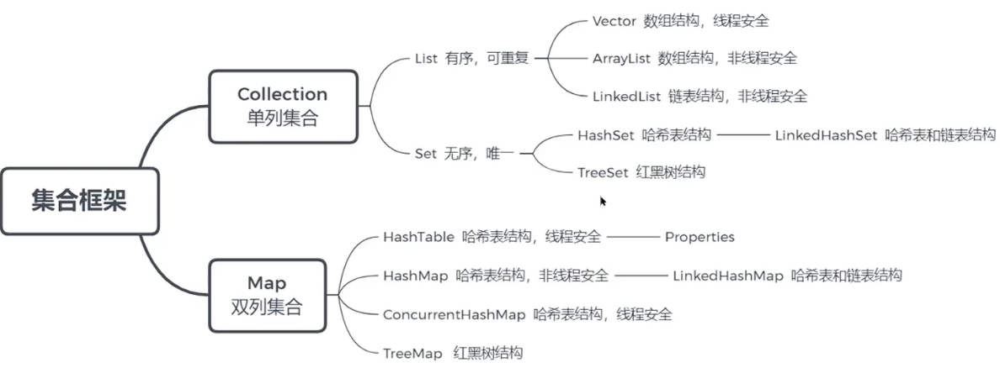
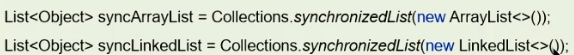
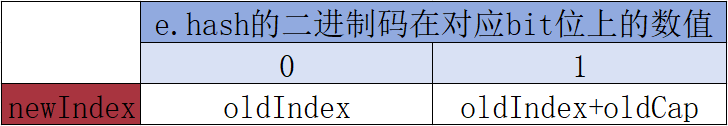
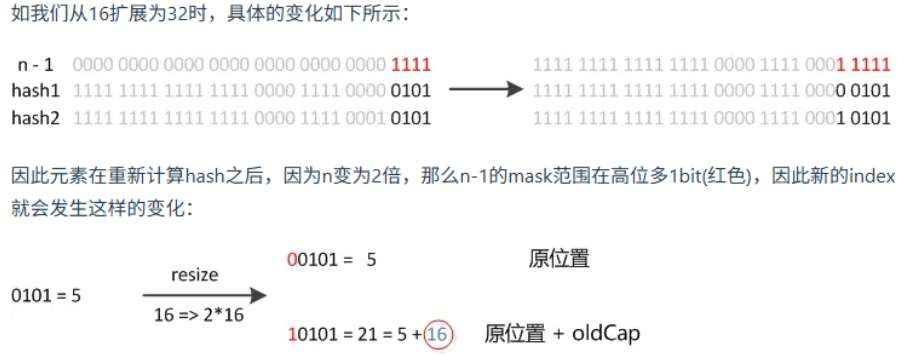
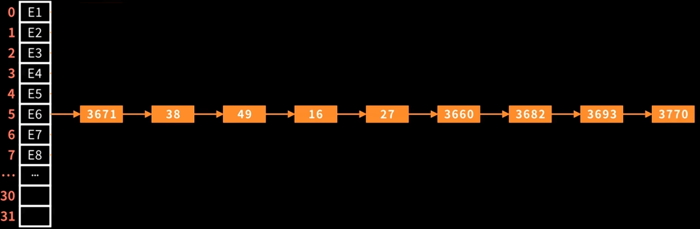
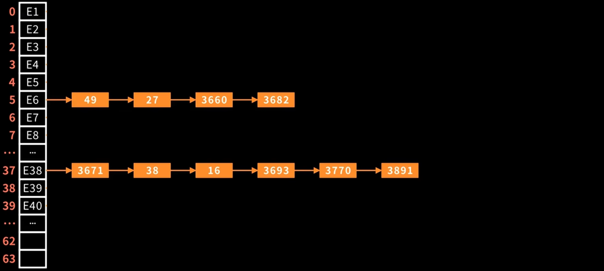
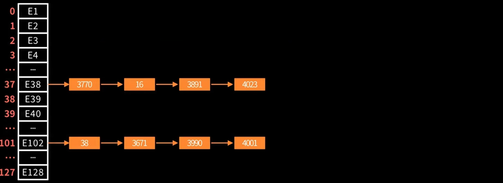
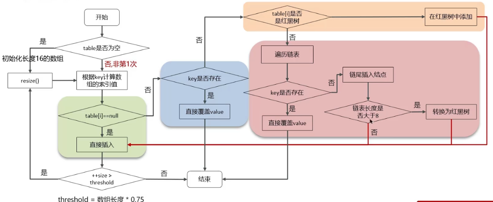

## 1.Java集合框架体系

## 2.数组
寻址公式：baseAddress + i\*dataTypeSize
时间复杂度
- 查询
	1. 已知下标：O(1)
	2. 未知下标：O(n)
	3. 未知下标单排序：O(logn)-采用二分查找
- 新增和删除：O(n)
## 3.ArrayList
- 底层数据结构：数组
- 容量：初始容量为0；第一次添加数据时，初始化容量为10
- 扩容：扩容到原来容量的1.5倍，每次扩容都需要拷贝数组
- 添加数据的逻辑：
	- 确保数组 已使用长度(size)+1<数组容量
	- 如果容量不够，则调用grow方法扩容（原来的1.5倍）
	- 拷贝数组，并将新元素添加到对应位置上
	- 返回True
问题：ArrayList list=new ArrayList(10)中的list扩容了几次？
	在构造ArrayList时，如果指定了容量（10），底层会直接初始化一个对应容量的数组，因此不会扩容
## 4.数组和List之间的转换
- 数组 → List：java.util.Arrays.asList(数组)
- List → 数组：List.toArray()
问题：如果修改了转换后的数组/List，原List/数组会受影响吗？
- 数组 → List：会受影响
	因为转后得到的List集合底层的数组结构，依然是原数组，因此最终都指向同一个内存地址
- List → 数组：不会影响
	底层进行的是数组拷贝，转换后得到的新数组与List底层的数组指向不同的内存地址
## 5.链表
时间复杂度
- 查询：O(n)
- 新增和删除：O(n)
## 6.ArrayList和LinkedList的区别
1. 底层数据结构
	- ArrayList：动态数组
	- LinkedList：双向链表
2. 操作效率
	- 查找：ArrayList在下标查询情况下为O(n)；其他情况下与LinkedList一样都是O(n)
	- 新增和删除：都为O(n)
3. 内存空间占用
	- ArrayList：底层数组内存连续，节省内存
	- LinkedList：双向链表需要额外存储指针，更占内存
4. 线程安全
	- 两者都不是线程安全的
	- 如果需要保证线程安全，有两种方案
		1. 在方法内使用，局部变量是线程安全的
		2. 使用线程安全的ArrayList和LinkedList
		
## 7.红黑树
- 自平衡二叉搜索树
- 时间复杂度：查询、新增、删除的时间复杂的都是O(logn)
## 8.散列表（Hash表）
##### 8.1什么是散列表
根据键（Key）直接访问在内存存储位置值（Value）的数据结构
##### 8.2散列冲突
定义：又称哈希碰撞，指多个key映射到同一个数组下标位置
解决措施 - 拉链法：
- 数组的每个下标位置称为桶（槽）
- 每个桶（槽）对应一条链表
- 散列冲突后的元素都放到相同槽位对应的链表中或红黑树中
## 9.HashMap
- 底层数据结构：数组 + 链表/红黑树
- 容量：初始容量为0；第一次添加数据时，初始化容量为16
- 扩容：
	- 扩容时机：
		1. 第一次添加数据
		2. 键值对数量超过容量阈值（数组长度\*0.75）
		3. 链表长度>8 and and 数组长度<64
	- 扩容大小：第一次添加数据时初始化为16，之后每次扩容到之前的2倍
	- 扩容后的元素移动
		- 数组上的节点：index = e.hash(newCap -1)
		- 链表上的节点：扩容后，(newCap -1)的二进制码在高位多1bit位，e.hash的二进制码在对应bit位上是1/0，决定其在新数组上的索引位置
		
		
		
		
		- 红黑树上的节点：与链表同理，区别在于拆分后得到的两个红黑树长度若小于6，则退化为链表
		
- 添加数据：
	- 根据key计算hash值得到数组索引
	- table[i] == null or table[i] == key：直接覆盖
	- table[i]为链表：
		1. 遍历链表：存在相同元素→直接覆盖；否则→尾插数据
		2. 链表长度>8 and 数组长度<64：触发扩容
		3. 链表长度>8 and 数组长度>64：链表转换为红黑树
	- table[i]为红黑树：按照红黑树规则插入
	- 判断存储的键值对数量是否超过容量阈值（数组长度\*0.75），如果超过，触发扩容
- 获取数据：通过key的hash计算数组下标获取元素
	
问题：HashMap在JDK1.7和1.8有什么区别
- JDK1.8之前：数组+链表
- JDK1.8之后：数组+链表/红黑树，链表长度大于8且数组长度大于64则会从链表转化为红黑树