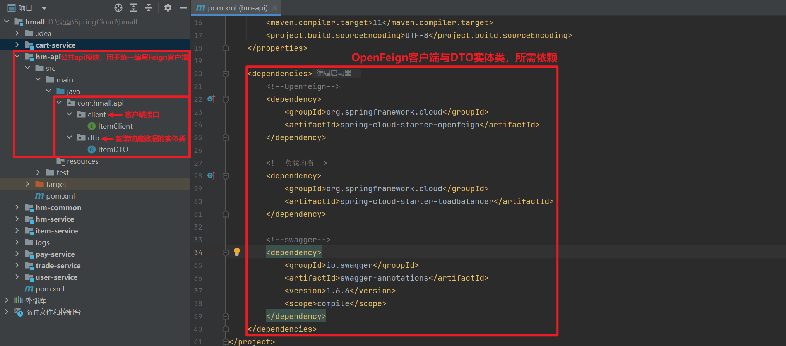
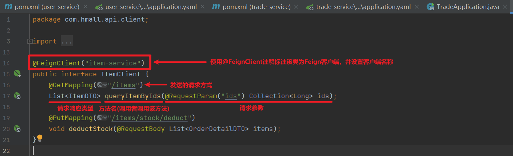
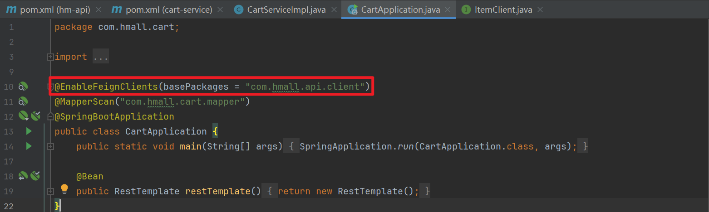
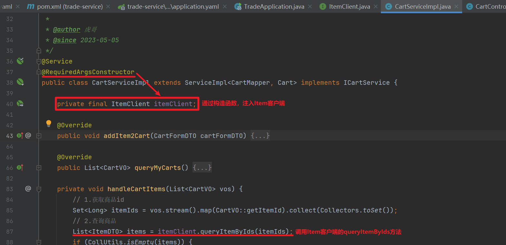
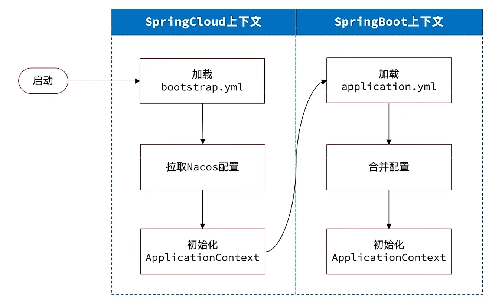
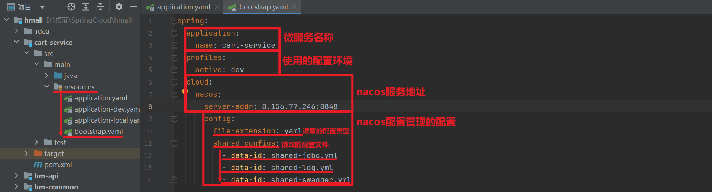

## 1.1注册中心原理
- 服务提供者：在注册中心中注册服务信息
	  ​注册中心中，同一服务的提供者可能有多个，同时所有提供者都需要定期向注册中心发送心跳续约。如果某一提供者没有定时向注册中心心跳续约，那么注册中心就会删除该提供者的信息，并告知订阅了该服务的服务调用者
^ee6b8e
- 服务调用者：向注册中心订阅并获取所需服务的服务信息
	  ​服务调用者采用负载均衡算法，远程调用某一服务提供者
 ^621019
- 服务监控：服务提供者每隔5s向Nacos发送心跳，如果Nacos服务在固定时间窗口内没有接收到心跳，就会将该服务从Nacos中剔除（非临时示例不会被剔除） ^f7fd73
## 1.2实战：注册中心+远程过程调用
**创建公共的API模块**
	该模块下编写各种用于提供服务的Feign客户端，服务调用者通过导入该模块的依赖，即可使用各种Feign客户端
1. 公共模块引入OpenFeign、负载均衡依赖(服务调用者导入该模块后，也就同样引入了这两个依赖)
```
<!--Openfeign-->
<dependency>
    <groupId>org.springframework.cloud</groupId>
    <artifactId>spring-cloud-starter-openfeign</artifactId>
</dependency>

<!--负载均衡-->
<dependency>
    <groupId>org.springframework.cloud</groupId>
    <artifactId>spring-cloud-starter-loadbalancer</artifactId>
</dependency>
```

2. 在公共api模块的client包下，编写需要用于提供外部服务的接口


**服务提供者模块**
1. 引入Nacos依赖
```
<dependency>
    <groupId>com.alibaba.cloud</groupId>
    <artifactId>spring-cloud-starter-alibaba-nacos-discovery</artifactId>
</dependency>
```
2. 配置Nacos地址
```
spring:
  cloud:
    nacos:
      server-addr: 8.156.77.246:8848
```

**服务调用者模块**
	引入Nacos、公共api模块，使用远程服务
1. 引入Nacos依赖
```
<!--nacos 服务注册发现-->
<dependency>
    <groupId>com.alibaba.cloud</groupId>
    <artifactId>spring-cloud-starter-alibaba-nacos-discovery</artifactId>
</dependency>

<!--hm-api-->
<dependency>
    <groupId>com.heima</groupId>
    <artifactId>hm-api</artifactId>
    <version>1.0.0</version>
</dependency>
```
2. 配置Nacos地址
```
spring:
  cloud:
    nacos:
      server-addr: 8.156.77.246:8848
```
3. 调用者模块启动项使用`@EnableFeignClient`注解，启用OpenFeign功能，并指定调用的客户端的所属包名以便Spring可以扫描到客户端Bean
```
@EnableFeignClients(basePackages = "com.hmall.api.client")
```

4. 注入需要使用的Feign客户端，在需要的位置调用客户端提供的方法

## 2.1配置中心
解决以下问题：
- 微服务中的重复配置过多，维护成本高
- 业务配置经常变动，每次修改都要重启服务
## 2.2实现配置中心
1. 进入Nacos客户端，将共享配置添加到Nacos的配置管理中


2. 将共享配置中不一致的配置信息，写到微服务项目自身的application.yaml文件中

3. 引入配置管理所需依赖
  ​	基于Nacos共享配置后，微服务在启动时会先加载Nacos中的共享配置，然后加载微服务自己配置文件中的配置信息，最后启动项目。但由于Nacos的服务地址写在微服务的配置文件中，导致需要先加载微服务自身的配置才能访问到Nacos，在这种矛盾情况下，就要使用Spring Cloud提供的bootstrap.yaml配置文件（引导配置文件），使用后微服务在启动前会优先读取该配置文件中的内容
  
```
<!--使服务可以读取nacos配置文件-->
<dependency>
    <groupId>com.alibaba.cloud</groupId>
    <artifactId>spring-cloud-starter-alibaba-nacos-config</artifactId>
</dependency>
<!--创建、读取bootstrop文件-->
<dependency>
    <groupId>org.springframework.cloud</groupId>
    <artifactId>spring-cloud-starter-bootstrap</artifactId>
</dependency>
```
4. 编写bootstrap.yaml

## 2.3配置热更新
> 配置热更新：当修改配置文件中的配置时，微服务无需重启即可使配置生效

前提条件：
1. Nacos中要有一个与微服务有关的配置文件
```
   [spring.application.name]-[spring.profile.active].[file-extension]
```
2. 微服务中要以特定方式，读取需要热更新的配置
   使用@ConfigurationProperties注解
```
@Data
@ConfigurationProperties(prefix = "hm.cart")
public class CartProperties {
    private int maxItems;
}
```
## 3.临时示例和非临时示例
- 临时示例 ^882c40
   1. 默认类型
   2. 采用心跳机制保持活性
   3. 服务下线或异常时，Nacos会主动剔除
- 非临时示例 ^66b2e9
   1. 需要手动配置
   2. 采用Nacos主动探测机制
   3. 即使心跳异常，Nacos也不会主动剔除