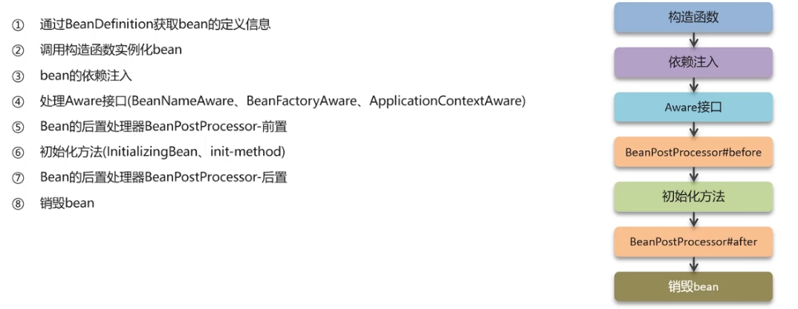

## 1.单例Bean时线程安全的吗
不是线程安全的
Spring中的Bean一般都是注入无状态的对象，因此没有线程安全问题，如果Bean中定义了可修改的成员变量，是要考虑线程安全问题的，可以使用多例或者加锁解决
## 2.AOP
##### 2.1什么是AOP
面向切面编程，用于将那些与业务无关，但却对多个对象产生影响的公共行为和逻辑，抽取成公共模块复用，降低耦合
##### 2.2项目中哪里可以使用到AOP
记录操作日志、缓存、Spring实现的事务
使用方式：使用AOP中的环绕通知 + 切点表达式（找到要记录日志的方法），通过环绕通知的参数获取请求方法的参数（类、方法、注解、请求方式），获取到这些参数以后，保存到数据库中
##### 2.3Spring中的事务是如何实现的
本质是通过AOP功能，对方法前后进行拦截，在执行方法之前开启事务，在执行完目标方法之后根据执行情况提交或回滚事务
## 3.Spring中事务失效的场景
- 方法中出现异常后没有抛出，而是自己处理了异常：手动抛出
- 抛出了受检异常：`@Transactional` 配置rollback属性为Exception
- 非public方法导致的事务失效：改为public
## 4.Spring中Bean的生命周期

## 5.Bean中的循环依赖问题
定义：两个或两个以上的Bean互相持有对方，最终形成闭环（比如A依赖B，B依赖A）
解决方案：三级缓存
- 一级缓存：缓存已经初始化完成的Bean实例（单例池）
	- **仅使用一级缓存就可以解决循环依赖，为什么还需要二级缓存**
		为打破死锁，Spring在Bean实例化后立刻放入一级缓存，这样另一个Bean依赖时就可以拿到早期实例，结束循环。但这样会导致一级缓存同时存放早期对象和完全初始化的对象，增加线程安全风险
	- **多线程场景下，一级缓存存放半成品Bean带来的并发问题**
		如果一个线程正在创建Bean，另一个线程通过一级缓存取得未初始化完成的半成品，使用时可能出现空指针异常或者数据不完整
- 二级缓存：缓存早期的Bean对象（生命周期还没走完）
	- **使用二级缓存隔离早期Bean，解决了循环依赖问题，为什么还需要三级缓存**
		AOP会在Bean初始化阶段创建动态代理对象，
	- 存在的问题：Bean的生命周期规范中规定，Bean在初始化后才能生成代理，如果Bean使用了动态代理，在不使用三级缓存的情况下，会出现AOP代理对象内存地址不一致的问题，即B引用的是初始化完成的A，而一级缓存中放入的确实A的代理对象
- 三级缓存：缓存ObjectFactory（对象工厂）
	- 作用：在最大限度遵循Spring
